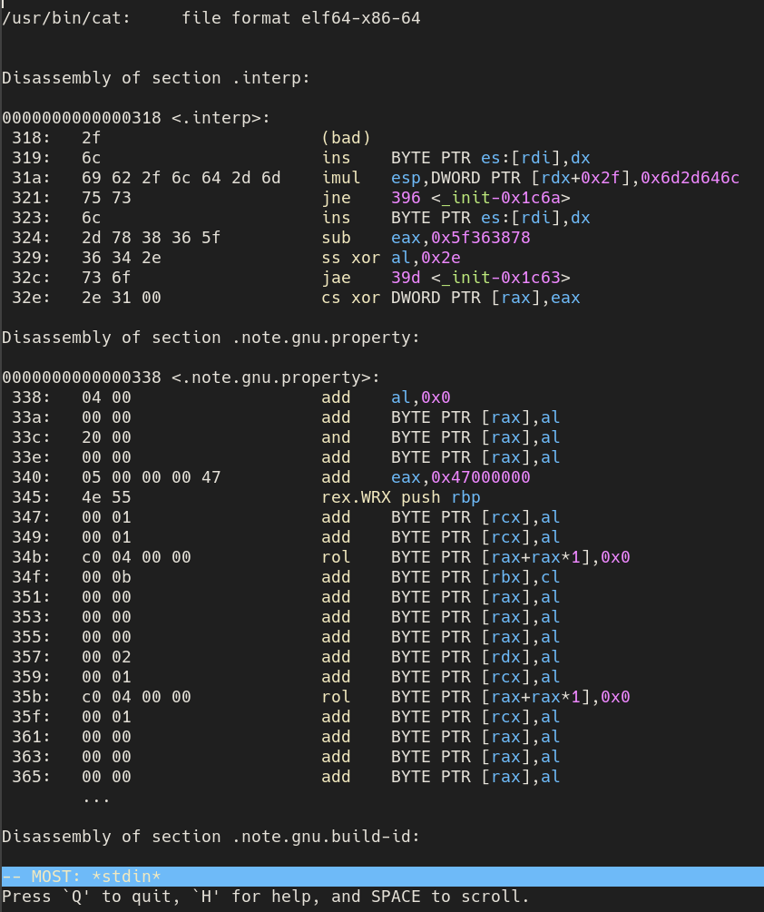
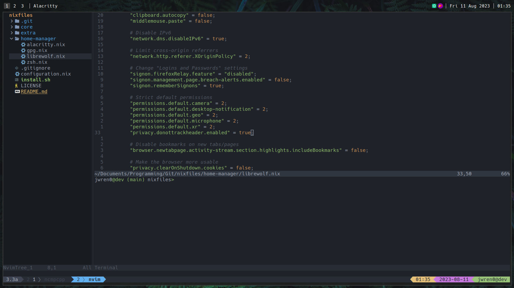

<div align="center">
  <h1>Nixfiles</h1>
  <p>
    A collection of files I use for configuring <strong><a href="https://nixos.org">NixOS</a></strong>.
  </p>
  <p>
    Work in progress...
  </p>
</div>

# 🌱 Abstract
This repository contains my personal configuration files for NixOS. It is a work in progress and is subject to change at any time.

# 🛠️ Install
```sh
$ sudo nix-channel --add https://github.com/nix-community/home-manager/archive/release-23.05.tar.gz home-manager
```

```sh
$ sudo nix-channel --update
```

```sh
$ sudo ./install.sh
```

# 🗺️ Roadmap

- [] [] []
- [x] [2023.08.04] [v1.0.5] Update #2
  - Change #1
  - Change #2
  - Change #3
- [x] [2023.07.25] [v1.0.0] Update #1

# 🖼️ Gallery

<table align="center" border="5px">
  <tr align="center">
    <td width="50%">
      
      <p>
        <em>
          Small part of objdump, but not highly customised.
        </em>
      </p>
    </td>
    <td width="50%">
    </td>
  </tr>
  <tr align="center">
    <td colspan=2>
      
      <p>
        <em>
          Neovim within tmux, leveraging custom config.
          <br>
          Window Manager = 'qtile', Terminal Emulator = 'alacritty'
        </em>
      </p>
    </td>
  </tr>
</table>
